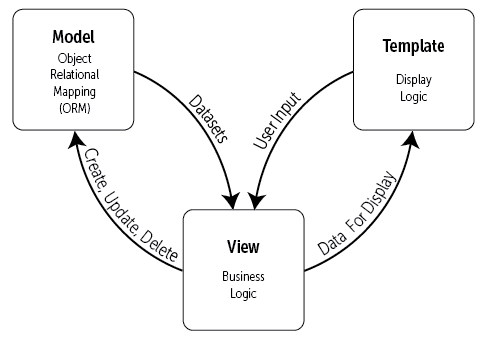

# <span style="color:lightseagreen">Django Project:</span>

A Django Project is a collection of applications and configurations that, when combined together, will make up the full web application

<br>

# <span style="color:lightseagreen">Django App:</span>

## <span style="color:palegreen">Overview:</span>

A Django Application is created to perform a particular functionality for your entire web application

- **Example:** Registration app, polling app, comments app etc.

- These Django Apps can then be plugged into other Django Projects, so you can reuse them

The main architectural design pattern employed by Django is:

1. Model
1. View
1. Template

<br>

  
<br>

## <span style="color:palegreen">Django App Files:</span>

- \_\_init\_\_.py
  - This is a blank Python script that, due to its special name, let's Python know that this directory can be treated as a package
- `admin.py`
  - You can register your models here which Django will then use in the Django admin interface
- `apps.py`
  - Here you can place application specific configurations
- `models.py`
  - Place to store the applicatiion's data models
- `tests.py`
  - Here you can store a series of functions to test out your application's code
- `views.py`
  - This is where you have functions that handle requests and return responses
  - Each view must return a response
- migrations folder
  - Directory that stores database specific information as it relates to the models
  - A migration allows you to move databases from one design to another
    - This is also reversible

<br>

## <span style="color:palegreen">URL Mapping:</span>

- The `include()` function allows us to look for a match with regular expressions and link back to our application's own `urls.py` file

- We would add the following to the project's urls.py:

```python
from django.urls import path, include

urlpatterns = [
  path("", include("first_app.urls")),
]
```

OR

```python
from django.urls import url, include

urlpatterns = [
  url(r"^$", include("first_app.urls")),
]
```

<br>

## <span style="color:palegreen">Models:</span>

We use Models to incorporate a database into a Django Project

- Django comes equipped with SQLite
- SQLite will work for our simple examples, but Django can connect to a variety of SQL engine backends

To create an actual model, we use a class structure inside of the relevant applications `models.py` file

- This class object will be a subclass of Django's built-in class:
  - django.db.models.Models
- Then each attribute of the class represents a field, which is just like a column name with contraints in SQL

<br>

### <span style="color:lightyellow">SQL Database:</span>

SQL operates like a giant table, with each column representing a field, and each row representing an entry

- Each column has a type of field, such as a CharField, IntegerField, DateField etc
- Each field can also have constraints:
  - For example, a CharField should have a max_length constraint, indicating the maximum number of characters allowed
- Tables (or models) relationships
  - Often models will reference eachother
  - For this referencing to work, we use the concepts of <span style="color:yellow">Foreign Keys</span> and <span style="color:yellow">Primary Keys</span>

<br>

Imagine we have two models

- One to store website information, another to store data information
- We could say that the WebsiteId column is a primary key in the left table and foreign key in the right table
  - Primary Key is a unique identifier for each row in a table
  - Foreign Key just denotes that the column coincides with a primary key of another table

<br>

---

| WebsiteId | WebSiteName | URL              |
| --------- | ----------- | ---------------- |
| 1         | Google      | www.google.com   |
| 2         | Facebook    | www.facebook.com |

---

| WebsiteId | Date Accessed |
| --------- | ------------- |
| 1         | 2018-01-01    |
| 2         | 2018-02-03    |

---

</br>

## <span style="color:palegreen">Setting Up Models:</span>

After we have set up the models, we can then migrate to the database

- This basically let's Django do the heavy lifting of creating SQL databases that correspond to the models we created

```python
class Topic(models.Model):
  top_name = models.CharField(max_length=264, unique=True)

class WebPage(models.Model):
  category = models.ForeignKey(Topic)
  name = models.CharField(max_length=264)
  url = models.URLField()

  def __str__(self):
    return self.name

```

</br>

Django can do this entire process with a simple command:

```
py manage.py makemigrations
py manage.py migrate
```

</br>

In order to use the more convenient Admin interface with the models however, we need to register them to our application's `admin.py` file.  
We can do this with the following code:

```python
from django.contrib import admin
from app.models import Model1, Model2

```

</br>

Then with the models and database created, we can use Django's fantastic Admin interface to interact with the database

- This Admin interface is one of the key features of Django!

</br>

In order to fully use the database and the Admin, we will need to create a "superuser"

```
py manage.py createsuperuser
```

</br>

## <span style="color:palegreen">Interacting with the Python Shell:</span>

After migrating the models created above, we can use the python interactive shell to test out our new models  
Code below is entered in the terminal:

```python
(env) PS C:\Users\James\Desktop\Django_Projects\Django_Project_Two> py manage.py shell

(InteractiveConsole)

>>> from second_app.models import Topic

>>> print(Topic.objects.all())

<QuerySet []>

>>> t = Topic(top_name="Social Network")

>>> t.save()

>>> print(Topic.objects.all())

<QuerySet [<Topic: Social Network>]>

```

<br>

# <span style="color:lightseagreen">Models-Templates-Views:</span>

## <span style="color:palegreen">Overview:</span>

Django operates on what is known as Models-Templates-Views

- This is also called "MTV" and encompasses the idea of how to connect everything we've talked about so far: models, templates and views

<br>

There are a few basic steps to achieving the goal of serving dynamic content to a user based off the connection of the models, views and templates:

1. In the `views.py` file we import any models that we will need to use
1. Use the view to query the model for data that we will need
1. Pass results from the model to the template
1. Edit the template so that it is ready to accept and display the data from the model
1. Map a URL to the view

<br>

## <span style="color:palegreen">Example From Course:</span>

<br>

### <span style="color:lightyellow">Models:</span>

```python
from django.db import models
from django.db.models.deletion import CASCADE


class Topic(models.Model):
    top_name = models.CharField(max_length=264, unique=True)

    def __str__(self):
        return self.top_name


class Webpage(models.Model):
    topic = models.ForeignKey(Topic, on_delete=CASCADE)
    name = models.CharField(max_length=264, unique=True)
    url = models.URLField(unique=True)

    def __str__(self):
        return self.name


class AccessRecord(models.Model):
    name = models.ForeignKey(Webpage, on_delete=CASCADE)
    date = models.DateField()

    def __str__(self):
        return str(self.date)

```

<br>

### <span style="color:lightyellow">Views:</span>

```python
from django.shortcuts import render
from django.http import HttpResponse
from .models import Topic, Webpage, AccessRecord


def index(request):
    webpages_list = AccessRecord.objects.order_by("date")
    date_dict = {"access_records": webpages_list}

    return render(request, "second_app/index.html", context=date_dict)

```

<br>

### <span style="color:lightyellow">URLs:</span>

```python
from django.urls import path
from . import views

app_name = "second_app"

urlpatterns = [
    # Homepage View
    path("", views.index, name="index"),
]

```

<br>

### <span style="color:lightyellow">Template:</span>

```html
<!DOCTYPE html>


<html lang="en">
  <head>
    <meta charset="UTF-8" />
    <meta http-equiv="X-UA-Compatible" content="IE=edge" />
    <meta name="viewport" content="width=device-width, initial-scale=1.0" />
    <title>Django Level Two</title>
    <link rel="stylesheet" href="" />
    <link
      rel="stylesheet"
      href="https://stackpath.bootstrapcdn.com/bootstrap/4.3.1/css/bootstrap.min.css"
      integrity="sha384-ggOyR0iXCbMQv3Xipma34MD+dH/1fQ784/j6cY/iJTQUOhcWr7x9JvoRxT2MZw1T"
      crossorigin="anonymous"
    />
  </head>

  <body>
    <h1>Hi welcome to Django Level Two</h1>
    <h2>These are your access records:</h2>

    <div class="container">
      
      <table class="table table-bordered table-striped table-hover">
        <thead>
          <th>Site Name</th>
          <th>Date Accessed</th>
        </thead>

        
        <tr>
          <td>{{ acc.name }}</td>
          <td>{{ acc.date }}</td>
        </tr>
        
      </table>
      
      <p>No Access Records Found</p>
      
    </div>
  </body>
</html>
```

<br>

### Index View:


